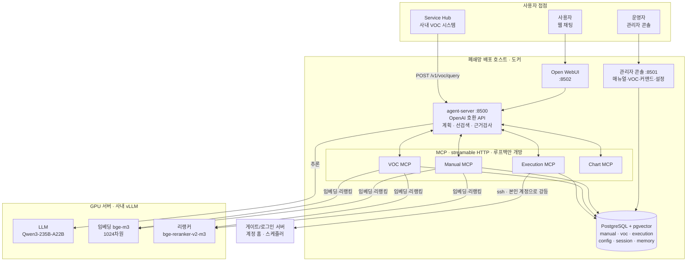
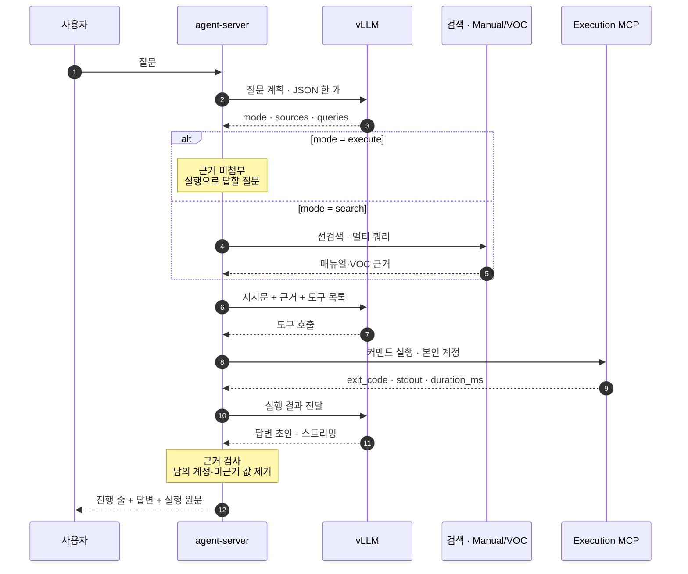
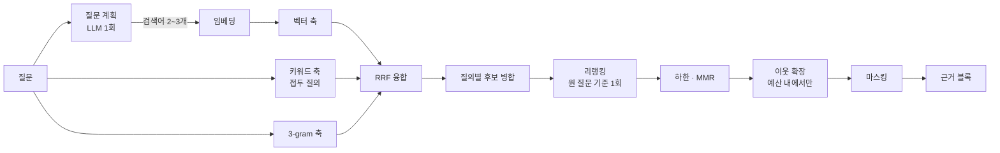
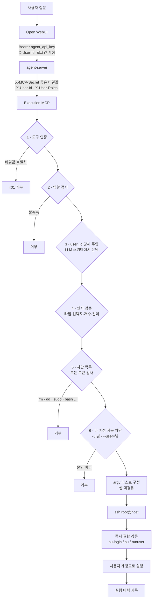

# AI Infra Assistant

사내 인프라·시스템 운영 문의를 받아 **매뉴얼과 과거 문의(VOC)에서 근거를 찾고, 필요하면
사용자 본인 권한으로 커맨드를 실행해** 한국어로 답하는 에이전트.

- 폐쇄망 전용. 외부 API 호출 없음. LLM·임베딩·리랭커 전부 사내 vLLM.
- 답변 근거는 **매뉴얼 / 과거 사례 / 실행 결과** 셋뿐. 그 밖은 차단.

| 문의 유형 | 예 | 답의 출처 |
|---|---|---|
| 어떻게 하는가 | "GPU 서버 접속 방법" | 매뉴얼 |
| 왜 안 되는가 | "로그인 서버 접속 불가" | 과거 사례(VOC) + 매뉴얼 |
| **내 값이 얼마인가** | "내 홈 용량" | **실행해야만** 확인 가능 |

세 번째가 핵심. 계정마다 다른 값은 문서에 부재 → 실제 조회 필요 → 그 조회는 **반드시
문의한 사용자 본인 권한**으로 수행.

---

## 1. 전체 구조

| 구성요소 | 역할 |
|---|---|
| **agent-server** | 요청 처리의 중심. 계획 → 선검색 → 에이전트 → 근거 검사 → 후처리 |
| **Manual / VOC MCP** | 하이브리드 검색. 읽기 전용 |
| **Execution MCP** | 커맨드 실행 전담. 등록 커맨드는 각각 전용 도구, 그 밖은 `run_command` |
| **Chart MCP** | 수치를 SVG로 변환. 실행·DB 조회 없음 |
| **관리자 콘솔** | 매뉴얼/VOC 적재, 커맨드 등록, 설정, VOC 처리주체 분류 |
| **Service Hub** | 사내 VOC 시스템 연동. 접수 문의를 API로 위임 |

---

## 2. 요청 처리 흐름

**핵심 두 가지**

- **검색 여부를 모델이 결정하지 않음.** 코드가 먼저 검색해 근거를 주입 → "검색 누락"이라는
  실패 자체가 성립 불가.
- **꼭 필요한 것은 LLM 밖 경로로 표시.** 실행 결과 원문·진행 상황·미근거 값 차단 셋 다 코드.

---

## 3. 실현한 기법

### 검색

| 기법 | 해결한 문제 |
|---|---|
| **하이브리드 3축 + RRF** — 벡터·키워드·3-gram을 `1/(60+rank)` 합산 | 스케일이 다른 축을 정규화 없이 결합 |
| **접두 질의** — `to_tsquery('simple', '서버:* \| 위치:*')` | `simple` 사전은 형태소 분석 부재 → `서버` ≠ `서버별`로 키워드 축 사문화 |
| **멀티 쿼리** — 계획이 만든 다른 표현으로 후보 추가 수집 | 사용자 문장과 문서 표현의 불일치("서버 위치" vs "서버별 Location") |
| **후보/리랭킹 분리** — 질의는 여럿, 리랭킹은 원 질문 기준 1회 | 질의마다 리랭킹 시 리랭커 왕복이 질의 수만큼 증가 |
| **Cross-encoder 리랭킹 + 관련도 하한** | RRF 상위가 곧 정답은 아님 |
| **Contextual retrieval** — 리랭커 입력에 `문서 > 섹션` 접두 | 청크 본문만으로 문서 주제 판별 불가 |
| **MMR 중복 제거** | 유사 문의가 상위 독점 |
| **이웃 청크 확장 + 예산 우선 배치** | 절차 중간 단계 누락 / 이웃이 예산을 소진해 **검색된 표가 잘려 나감** |
| **선검색 강제** | 모델의 도구 호출 누락 |

### 에이전트

| 기법 | 내용 |
|---|---|
| **질문 계획** | 실행/검색 · 근거 선택 · 검색어 생성을 JSON 한 개로. 파싱 실패 시 안전한 기본값 |
| **근거 미첨부** | 실행이 필요한 질문에는 근거를 **의도적으로 미첨부**. 보이면 그것으로 답하고 실행 생략 |
| **현재 질문 고정** | `# 이번에 답할 질문` 블록을 선두 주입. 앞 질문 이어받기 차단 |
| **주입 블록 우선** | 실행 규칙을 DB 지시문이 아닌 매 요청 블록에 배치. 지시문 미반영과 무관하게 적용 |
| **도구 편향 보정** | 일반 실행기를 도구 목록 선두 배치 + 등록 도구마다 "이 커맨드의 출력만 반환" 명시 |
| **진행 중계** | MCP 종류별 한 줄 생성. 도구 이름 비노출, 실제 커맨드만 표시 |
| **스트리밍 정규화·복구** | 누적/증분 혼재 이벤트를 증가분만 전송. 툴콜 파싱 실패 시 논스트리밍 1회 재시도 |
| **차트 인라인** | 짧은 표시자만 반환, 응답 직전 data URI 치환. 이력에는 표시자만 잔류 |

### 답변 신뢰성

| 기법 | 내용 |
|---|---|
| **근거 검사** | 답변의 IP·절대경로를 근거와 대조. 미근거 값이 든 **줄만** 제거, 나머지 보존 |
| **실행 원문 병기** | 도구 결과 원문을 LLM 경로 밖에서 첨부 |
| **처리 주체 분류** | 과거 사례를 LLM이 `user`/`operator`/`unknown`으로 판정해 저장 |
| **추측형 강제** | 운영자 처리·판정 불가 사례는 원인을 **여러 가능성**으로 제시. 단정 금지 |
| **개인정보 마스킹** | 검색 결과의 계정·이메일·이름·조직을 MCP 반환 **이전에** 치환 |
| **계측** | 도구 호출·결과·소요, 검색 단계별 건수, 계획 결과를 전부 로그화 |

### 검색 파이프라인

---

## 4. 보안 — 커맨드는 **본인 권한으로만** 실행

| 장치 | 막는 것 |
|---|---|
| **MCP 공유 비밀값** | 같은 망의 임의 프로세스가 MCP 직접 호출. db-init이 무작위 생성 |
| **역할 검사** | 권한 없는 사용자의 커맨드 사용 |
| **`user_id` 은닉·주입** | LLM이 남의 계정 지정. 스키마에서 감추고 호출자 헤더에서 주입 |
| **인자 명세** | 미등록 옵션·과다 인자. 선택형은 스키마에 값 고정 |
| **차단 목록 전 토큰 적용** | `mpirun … rm -rf /`, `bash -c "…"` 류 우회 |
| **타 계정 지목 차단** | `phd list -u 남의계정`. 판정 주체가 그 프로그램이라 OS 권한으로 차단 불가 |
| **셸 미경유** | 파이프·리다이렉션·와일드카드·명령 치환 무력화 |
| **root 실행 금지** | `ssh root@host` 직후 **항상** 호출자 계정으로 강등. 우회 경로 미제공 |
| **내부 포트 루프백 한정** | postgres·MCP 4종은 `127.0.0.1`에만 개방 |
| **실행 이력** | 계정·커맨드·인자·exit_code·소요 기록. 사후 추적 |

**데이터 보호**

| 대상 | 처리 |
|---|---|
| 검색된 남의 계정·이메일 | MCP 반환 **이전에** 치환. 프롬프트에 원문 미유입 |
| 답변에 등장한 타 계정 | 근거 유무와 무관하게 해당 줄 제거 후 확인 불가 안내 |
| 조직·이름 | 매뉴얼은 계정·이메일만(조직명은 절차의 일부), VOC는 전체 마스킹 |
| **실행 결과** | **마스킹 없음.** 실행은 항상 본인 권한이므로 결과 전체가 본인 정보 |

---

## 5. 데이터

| 저장소 | 내용 |
|---|---|
| `manual_db` | 매뉴얼 문서·청크·임베딩(`vector(1024)`), 문서 위치 |
| `voc_db` | 과거 문의/답변, 임베딩, 처리 주체(`handled_by`) |
| `execution_db` | 등록 커맨드와 인자 명세, 실행 이력 |
| `platform_config` | 전역 설정(모델 주소·임계값·스위치). 콘솔이 CRUD |
| `agent_session` / `memory` | 대화 세션, 장기기억 |

**처리 주체(`handled_by`)** — "답변의 조치를 사용자가 자기 권한으로 재현 가능한가"를 LLM이
판정한 값(`user` / `operator` / `unknown`). 에이전트는 이 값으로 *방법 안내* 와
*원인 추측 + 접수 안내* 를 구분.

---

> **이 저장소는 공개용 사본입니다.**
> 서버 주소·계정·경로는 전부 자리표시자로 치환(`10.0.0.30`, `ops.user`, `/home/users` 등).
> 실제 값은 배포 환경의 `.env`와 설정 DB에만 존재.
> 기본 모드에서는 코드만 반출하므로 `docs/`·`CLAUDE.md`·사이트 전용 운영 스크립트는 미포함.
