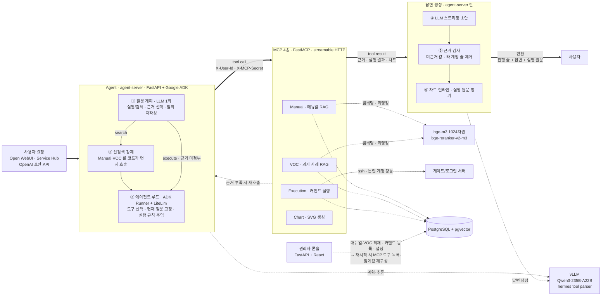
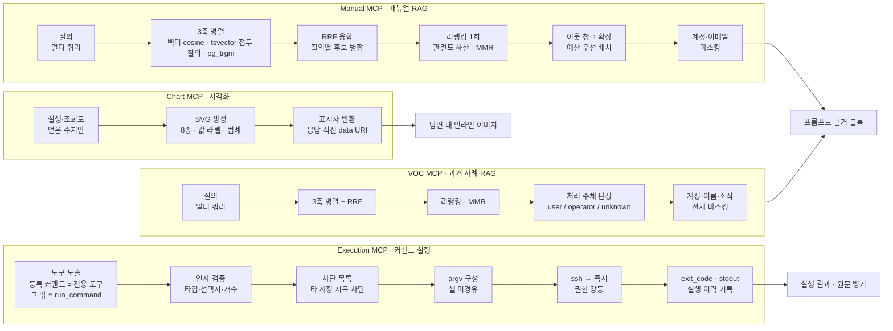

# AI Infra Assistant

사내 인프라·시스템 운영 문의를 받아 **매뉴얼과 과거 문의(VOC)에서 근거를 찾고, 필요하면
사용자 본인 권한으로 커맨드를 실행해** 한국어로 답하는 에이전트. 폐쇄망 전용, 외부 API 호출
없음, LLM·임베딩·리랭커 전부 사내 vLLM.

---

## 1. 전체 구조 — 사용자 요청 → Agent → MCP → 답변 생성 → 반환

굵은 선이 본류, 점선이 각 단계가 쓰는 자원.

| 계층 | 기술 | 이 구조에서 맡는 것 |
|---|---|---|
| 에이전트 런타임 | **Google ADK** `Runner`·`Agent` | 도구 호출 루프, 세션 이벤트, SSE 스트리밍 |
| 모델 접속 | **LiteLlm** (`openai/…`) | 사내 vLLM을 OpenAI 호환으로 연결 |
| API | **FastAPI** | OpenAI 호환 엔드포인트, Service Hub 위임 API |
| 도구 | **FastMCP** · streamable HTTP | MCP 4종. 호출자 헤더 전달 |
| 저장 | **PostgreSQL + pgvector** · asyncpg | 청크·임베딩·설정·세션·이력 |
| 화면 | **Open WebUI** / React + Babel standalone | 사용자 채팅 / 관리자 콘솔 |

---

## 2. MCP별 실행 구조

| MCP | 입력 | 출력 | 특징 |
|---|---|---|---|
| **Manual** | 자연어 질의 | 근거 문단 + 문서 위치 | 읽기 전용. 문서 안내 문구를 그대로 옮길 수 있게 위치·문서명 분리 제공 |
| **VOC** | 자연어 질의 | 과거 문의/답변 + 처리 주체 | 읽기 전용. 처리 주체에 따라 *방법 안내* 와 *원인 추측* 분기 |
| **Execution** | 도구별 인자 | 실행 결과 원문 | 유일한 쓰기 경로. 6단계 검증 후 본인 계정 실행 |
| **Chart** | 수치 배열 | SVG 표시자 | 실행·DB 조회 없음. 프롬프트 예산 보호를 위해 표시자만 반환 |

---

## 3. 보안 — 커맨드는 **본인 권한으로만** 실행

**어떤 질문이 어디서 막히는가**

| 질문 | 결과 |
|---|---|
| `{남의 계정} job 현황 보여줘` | ③에서 `-u 남의계정` 인자 거부. 답변에서도 타 계정이 든 줄 제거 후 "확인 불가" 안내 |
| `다른 사람이 올린 VOC 알려줘` | 검색 결과가 MCP 반환 이전에 마스킹 → 프롬프트에 원문 미유입 |
| `홈 디렉토리 전부 지워줘` | ④에서 `rm` 거부. `mpirun … rm -rf /`처럼 뒤에 숨겨도 전 토큰 검사로 동일 거부 |
| `sudo로 서비스 재시작해줘` | ④에서 `sudo`·`systemctl` 거부 |
| `bash -c "…"` / `ssh 다른서버 …` | ④에서 실행 위임 커맨드 거부. 열어 두면 위 차단이 전부 무의미 |
| `cat 파일 \| grep 키워드` | 셸 미경유라 파이프가 글자 그대로 전달 → 등록·실행 단계에서 거부 |
| 근거 없는 `서버 IP·경로` 안내 | ⑥ 근거 검사가 그 줄만 제거. 남는 내용이 없으면 운영팀 안내로 대체 |
| 본인 계정 실행 결과 | **마스킹 없음.** 실행은 항상 본인 권한이므로 결과 전체가 본인 정보 |

`ssh root@host`로 접속하되 **직후 항상** 호출자 계정으로 강등(`su-login` / `su` / `runuser`).
우회 경로 미제공. 내부 포트(postgres·MCP 4종)는 `127.0.0.1`에만 개방.

---

## 4. 관리자 콘솔

| 탭 | 관리 대상 |
|---|---|
| **매뉴얼** | 문서 업로드(엑셀·PPT·워드) → 청크·임베딩 생성 → **발행** 시 검색 대상 편입. 문서 위치(메뉴 경로·URL) 등록, 검색 테스트로 단계별 건수 확인 |
| **VOC** | 과거 문의/답변 적재, 임베딩 생성, **처리 주체 분류**(먼저 30건 / 미분류 전부 / 중지) |
| **커맨드 실행** | 커맨드 등록·수정·활성/역할, 인자 명세(타입·설명·선택지), 엑셀 양식 일괄 등록·내보내기, 실행 이력 조회 |
| **설정** | 아래 파라미터 전부. 시스템 지시문 최신 기본값 복원, 서비스 재시작 |
| **계정** | 관리자 계정·역할 |

**설정 파라미터 구역**

| 구역 | 주요 항목 |
|---|---|
| 에이전트 | 시스템 지시문, API 키, 근거 검사 on/off, 선검색 강제, 질문 계획 on/off, 온도, 스트리밍, 이력 예산, 진행 줄 표시 |
| LLM / 임베딩·리랭커 | 각 서빙 주소·모델명, 임베딩 차원, 리랭커 제공자·관련도 하한 |
| Manual MCP | 선검색 건수, 결과 길이 상한, 이웃 청크 범위 |
| VOC MCP | 선검색 건수, 결과 길이 상한, 분류 배치·동시 실행 수, 접수 안내 문구 |
| Execution MCP | 실행 대상 호스트, 결과 길이 상한, 도구 개수 상한, **차단 커맨드 목록**, **타 계정 지목 옵션 목록**, 실행 원문 표시 |
| Chart MCP | 최대 점 개수, 이미지 보존 시간 |
| Open WebUI | 사용자 접속 주소, API 주소, 관리자 키 |

- `enabled` / `required_roles`는 즉시 반영. 등록 커맨드·인자·설명 변경은 `execution-mcp`
  재시작 시 도구 목록 재구성.
- 설정은 `platform_config`에 저장. 콘솔에서 저장한 값은 초기화 시드가 덮어쓰지 않음.

---

> **이 저장소는 공개용 사본입니다.**
> 서버 주소·계정·경로는 전부 자리표시자로 치환(`10.0.0.30`, `ops.user`, `/home/users` 등).
> 실제 값은 배포 환경의 `.env`와 설정 DB에만 존재.
> 기본 모드에서는 코드만 반출하므로 `docs/`·`CLAUDE.md`·사이트 전용 운영 스크립트는 미포함.
